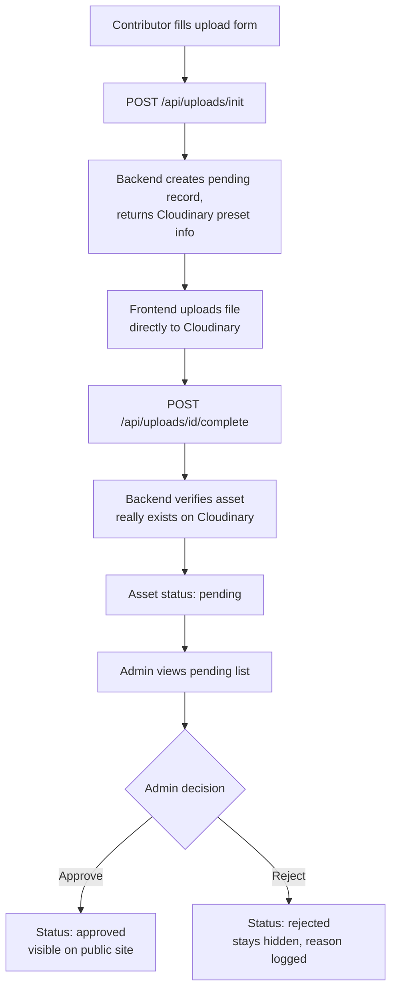

# EKITI@30 DIGITAL — Frontend PRD

Sep 25, 2026 · @Aynerd

## Purpose

This doc gives Esther (Frontend) the current backend reality so frontend work matches what actually exists, not what was originally planned. Backend has moved fast and changed shape a few times (auth model, embeddings provider, manifest columns) — this reflects where things stand right now.

## Current Backend Status

| Area | Status |
| --- | --- |
| Core app structure (FastAPI + Next.js scaffold) | Merged to main |
| Design tokens (colors, fonts from Member 6's spec) | Merged to main |
| Ask Ekiti knowledge base (models, ingestion, embeddings) | Merged to main (PR #20) |
| Embedding dimension config cleanup (#19) | Merged to main |
| Media upload + admin approval architecture | In review (PR #25) — do not build against this yet, endpoints may still change |

Everything in the "In review" row is real, working code (tested against a live Postgres database), but the reviewer has asked for security fixes before merge. Treat it as close but not final.

## Authentication & Roles

Login is handled by NextAuth.js, set up in the frontend project itself (credentials-based provider — real admin accounts, not a placeholder).

Two roles, carried as a claim inside the login token:

- **admin** — can review and approve/reject uploads
- **contributor** — any other logged-in user; can submit uploads

There is currently no public self-signup — every real account is admin-provisioned. If the project needs open contributor signup later, that's a separate decision not yet made.

**Frontend responsibility — updated:** build the login page using NextAuth. Important: the login token can only be safely read server-side, so do NOT call the backend's upload/admin endpoints directly from client-side browser JavaScript with the token attached. Instead, build a Next.js server-side API route (a route handler under `app/api/`) that reads the token server-side and forwards the request to FastAPI with the `Authorization: Bearer <token>` header. The browser calls your Next.js route; your Next.js route calls the backend — never the backend directly from client-side code.

## Data Models & Endpoints Summary

| Endpoint | Auth required | Purpose |
| --- | --- | --- |
| GET /api/health | None | Confirms backend is up |
| GET /api/timeline, /api/lgas, /api/stories, /api/vision2056 | None (stub) | Placeholder routes — real logic not built yet, don't build detailed UI against real data here yet |
| POST /api/uploads/init | Contributor or admin | Starts an upload: send contributor name, source, LGA, description, rights status, related content ID, and target folder. Returns a Cloudinary cloud name + unsigned preset name for the frontend to upload directly to Cloudinary |
| POST /api/uploads/{asset\_id}/complete | Contributor or admin | Call after the direct Cloudinary upload finishes, with the public\_id and secure\_url Cloudinary returns |
| GET /api/admin/assets/pending | Admin only | Lists uploads awaiting review |
| POST /api/admin/assets/{asset\_id}/approve | Admin only | Approves an asset |
| POST /api/admin/assets/{asset\_id}/reject | Admin only | Rejects an asset with a reason |

Important: the frontend never talks to Cloudinary's Admin API and never sees the Cloudinary API secret. It only ever calls our backend, plus Cloudinary's public unsigned-upload endpoint using the cloud name/preset our backend returns.

## Media Upload & Admin Approval Flow

Frontend builds two screens for this: the upload form (step A) and the admin review screen (steps H-K). The frontend never uploads through our backend — only Cloudinary gets the actual file.

## Ask Ekiti (AI Assistant) Status

Build the `/ask-ekiti` page as a static shell only for now — input box, a placeholder response area, nothing wired to a real endpoint yet.

What exists on the backend: the knowledge base database (real content mapped in), a free multilingual embedding model (confirmed working on Yoruba), and an LLM gateway for generating answers. What's NOT built yet: the actual `/api/ask-ekiti` logic that ties these together (retrieval + answer generation). Don't build the real chat UI logic against a live API yet — the request/response shape isn't finalized.

## Pages & Routes to Build

| Page | Priority | Notes |
| --- | --- | --- |
| Login page | High | NextAuth-based, needed before admin page can work |
| Upload form | High | Real endpoint exists (pending final security review) |
| Admin review page | High | Login-protected; list + approve/reject |
| Timeline, Explore Ekiti, My Ekiti Story, Ekiti 2056 | Medium | Build as static/stub pages — backend routes are placeholders, so use sample/dummy data for layout work now |
| Ask Ekiti | Low for now | Static shell only, per above |

Recommended order: login → upload form → admin review → the four content pages (stub data) → Ask Ekiti shell.

## Environment & Local Setup

- Clone the repo, `cd frontend`, `npm install`, `npm run dev` (serves on port 3000)
- Backend runs separately on port 8000 — ask Engineering for a `.env` with `NEXT_PUBLIC_API_URL=http://localhost:8000` and the `NEXTAUTH_SECRET` value (must match the backend's copy exactly; never commit the real value)
- Cloudinary cloud name and upload preset name are safe to hardcode or put in a public env var — they are not secret
- If `npm run lint` or `npm run dev` don't run at all (command not found errors on Windows), this is a known local install issue, not a code problem — try `npm install` again to rebuild the missing `.bin` folder before assuming the scripts are wrong

## Design System (Member 6, design-tokens.md v4, PR #14)

This is the implementation source of truth for styling — build from these values, not by eyeballing the homepage-preview.html reference file.

**Colors:**

| Token | Hex | Use |
| --- | --- | --- |
| --bg | #FFFFFF | Primary background |
| --bg-warm | #FFF8EA | Warm section background (hero, landmarks) |
| --bg-raised | #FCEFD2 | Card backgrounds |
| --ink | #221B12 | Primary text |
| --ink-soft | #6B5F49 | Secondary/muted text |
| --forest | #0B6B41 | Primary brand green |
| --forest-2 | #1FA35F | Accent green |
| --gold | #F2A400 | Primary brand gold |
| --gold-soft | #FFD866 | Light gold accent |
| --rust | #E8451F | CTA / primary action color |
| --teal | #0E8C8C | Secondary accent (photo placeholders, leader frames) |
| --teal-deep | #095F5F | Teal gradient pair |
| --line | rgba(34,27,18,0.12) | Borders, dividers |

**No dark mode** — explicit team decision, don't implement a prefers-color-scheme branch.

**Typography:** Fraunces (display/headings, variable, italic for emphasis) + Work Sans (body/UI), both via Google Fonts.

**Layout principles:**

- Hero: a "memory board" of tilted polaroid-style photo placeholders, not a stock banner. Two-column (text + collage) above \~940px, stacks to one column below that.
- Leaders strip, Landmarks strip, and Moments/milestones strip are all horizontally scrollable (overflow-x: auto) at every screen size — deliberate, not a mobile fallback. Leaders is a fixed list of 7; Landmarks and Moments are open-ended ("more coming" style).
- Feature grid: asymmetric "bento" layout, 6 columns above 900px collapsing to 2 below. Timeline and Ask Ekiti get larger tiles as flagship features.
- Photo placeholders are acceptable for launch — real photography is not a blocker, swap in later as sourced/rights-cleared.

**Mobile/technical behavior:**

- Sticky header, respects safe-area insets (env(safe-area-inset-top/bottom)) for notched devices
- Nav links collapse below 820px — rely on primary CTA or add a hamburger menu

**Existing components already built on member6/ui-ux-design** (reconcile with these rather than rebuilding from scratch): Hero.tsx, LeadersStrip.tsx, LandmarksStrip.tsx, MomentsSpine.tsx, FeatureGrid.tsx, TimelineView.tsx, Nav.tsx, Footer.tsx.

## Image & Media Specifications by Page (Member 6, IMAGE\_SPECIFICATIONS.md)

To prevent layout shifts and distortion, enforce these aspect ratios and minimum dimensions client-side (before upload) wherever the upload form is used for these purposes — not just as a backend afterthought.

| Section | Element | Aspect Ratio | Min Dimensions |
| --- | --- | --- | --- |
| Homepage | Hero polaroids / accent pins | 4:3 or 1:1 | 800x600px or 600x600px |
| Homepage | Leaders strip portraits | 1:1 | 400x400px |
| Homepage | Landmarks strip | 16:9 | 1200x675px |
| Timeline | Event visuals | 16:9 or 4:3 | 800x450px |
| Explore Ekiti | LGA header cards / landmark thumbnails | 16:9 | 640x360px |
| Explore Ekiti | Map markers/popups | 1:1 | 300x300px |
| Culture & Tourism | Destination hero/cards | 16:9 or 3:2 | 1200x800px |
| My Ekiti Story | Citizen story attachments | 4:3 or 16:9 | 800x600px |
| My Ekiti Story | Contributor portraits | 1:1 | 400x400px |
| Ekiti 2056 | Vision blueprint media | 16:9 | 1200x675px |

**File format:** .webp or .jpg/.jpeg preferred; .png only for logos/seals needing transparency. (Note: this is stricter than the general upload endpoint's currently broader allowed-formats list — flag to Engineering if these need to match exactly.)

**Naming convention:** lowercase-with-hyphens, category and location first, e.g. `lga-ikere-olosunta-01.jpg`, `timeline-1996-state-creation.jpg`.

**Architecture confirmation (matches what Engineering already built):** Cloudinary is the production storage/CDN/delivery layer; the database and 16\_Media/ tracking records hold metadata, verification status, and Cloudinary URLs/IDs — not the binary files themselves. Timeline black-and-white/lower-resolution archival scans are acceptable if verified, as an exception to the resolution minimums.

## Open Questions & Dependencies

- [ ] PR #25 (upload/admin architecture) is not yet merged — exact upload endpoint behavior could still shift slightly after security fixes
- [ ] Whether contributors get their own lightweight signup, or every real user is admin-provisioned like today, is unresolved
- [ ] Media dimension standards from Member 6 (4:3 for community story photos, 1:1 minimum 400×400px for contributor portraits) should be enforced client-side before upload, not just server-side
- [ ] Ask Ekiti's real API contract (request/response shape) is not finalized — don't build against it yet
- [ ] Timeline/Explore/Stories/2056 backend routes are still placeholders — confirm with Engineering before wiring real data fetching into those pages
- [ ] Reconcile Engineering's broader upload format list against Member 6's stricter webp/jpg/png-only spec, and merge member6/ui-ux-design's existing components (Hero, LeadersStrip, etc.) rather than rebuilding them
